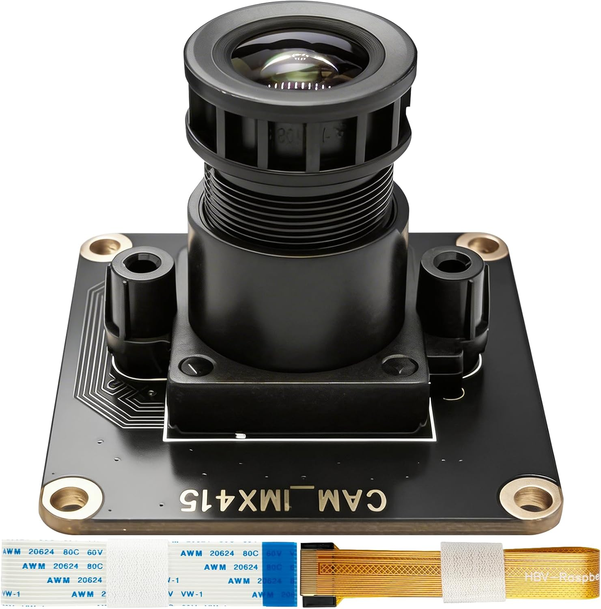

# CAM-MIPI-IMX415



The **CAM-MIPI-IMX415** is a 4K-capable camera module designed for Raspberry Pi, featuring the Sony IMX415 image sensor. With its high resolution and excellent low-light performance, this module is well suited for applications such as surveillance, machine vision, and high-quality imaging projects. It is fully compatible with the official `libcamera` stack on both Raspberry Pi 4 and Raspberry Pi 5.

## Features

- **Sensor**: Sony IMX415 — 8.42 Megapixel (4K) CMOS Image Sensor
- **Interface**: MIPI CSI-2
- **Compatibility**: Raspberry Pi 4 and Raspberry Pi 5
- **Software Support**: Works with `libcamera` and `rpicam-apps`
- **Low-light Performance**: High sensitivity suitable for night-vision and low-light environments

## Repository Contents

| File | Description |
| :--- | :--- |
| `CAM-IMX415-4K UserManual.pdf` | Full user manual with hardware specifications and setup guide |
| `images/imx415.jpg` | Product image |

## Quick Start

### 1. Hardware Connection

Connect the CAM-MIPI-IMX415 module to the MIPI CSI camera port on your Raspberry Pi using the provided ribbon cable. Make sure the metal contacts on the cable face the correct direction as indicated in the user manual.

### 2. Enable the Camera

On Raspberry Pi OS, open a terminal and run:

```bash
sudo raspi-config
```

Navigate to **Interface Options → Camera** and enable it, then reboot.

### 3. Verify Camera Detection

After rebooting, verify the camera is detected:

```bash
rpicam-hello --list-cameras
```

### 4. Capture Images and Video

```bash
# Preview
rpicam-hello -t 0

# Capture a JPEG image
rpicam-still -o image.jpg

# Record a video (10 seconds)
rpicam-vid -t 10000 -o video.h264
```

## Documentation

For detailed hardware specifications, driver installation, and advanced configuration, please refer to the [CAM-IMX415-4K UserManual.pdf](./CAM-IMX415-4K%20UserManual.pdf) included in this repository.

## Support

For technical support and product information, please visit [INNO-MAKER](https://www.inno-maker.com).
